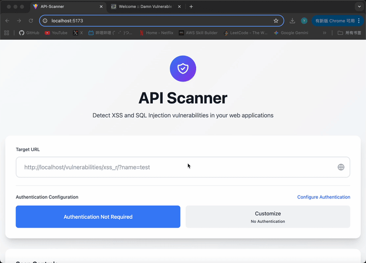
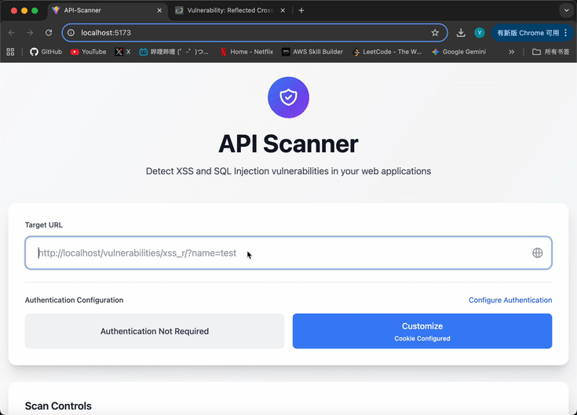
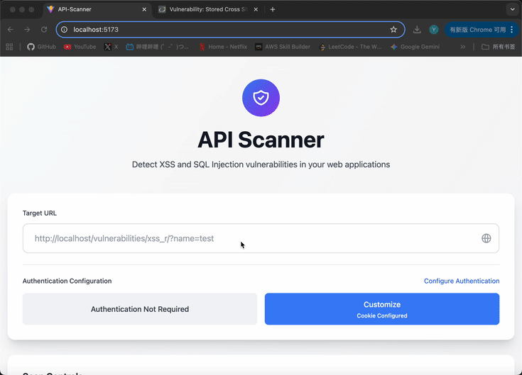

# API Security Scanner

A web application vulnerability scanner that automatically detects XSS and SQL Injection vulnerabilities.

## Demo

### Configure Authentication Data



### Scan XSS Vulnerabilities



### Scan SQL Injection Vulnerabilities


### Scan All



## Tech Stack
- **Frontend**: React, TypeScript, Tailwind CSS
- **Backend**: NestJS, TypeScript, Python
- **Testing Engine**: Custom Python scripts with BeautifulSoup4 and Requests

## Key Features

### Multi-Method Vulnerability Detection
- Time-based blind SQL injection with baseline response time analysis
- Error-based SQL injection with database-specific pattern matching
- Stored XSS detection with unique payload tracking
- Form submission testing (GET/POST)
- URL parameter fuzzing

### Authentication Support
- Cookie-based session handling
- Custom header authentication
- Pre-configured templates for common platforms (DVWA, WordPress, Laravel)

### Technical Highlights
- **Hybrid Architecture**: NestJS backend orchestrates TypeScript services and Python scanning scripts
- **Smart Detection**: Implements confidence scoring and false positive filtering
- **Real-time Analysis**: Concurrent scanning with progress tracking
- **Comprehensive Reporting**: Severity classification, evidence collection, and remediation suggestions

## Quick Start

### Prerequisites

- Node.js 16+
- Python 3.8+
- Docker

### Step 1: Setup Scanner

```bash
# Clone repository
git clone https://github.com/cyywww/api-scanner
cd api-scanner

# Backend setup
cd api-scanner-backend
npm install
pip install -r src/scripts/requirements.txt
npm run start:dev

# Frontend setup (new terminal)
cd api-scanner-frontend
npm install
npm run dev
```

### Step 2: Setup DVWA Test Environment

```bash
# Pull DVWA Docker image
docker pull vulnerables/web-dvwa

# Run DVWA container
docker run -d -p 80:80 --name dvwa vulnerables/web-dvwa

# Access DVWA at: http://localhost
# Default login: admin / password
```

#### DVWA Initial Configuration:

1. Login with `admin/password`
2. Click "Create/Reset Database" button
3. Login again after database creation
4. Copy the PHPSESSID from browser cookies

### Step 3: Run Security Scans

1. Open scanner at `http://localhost:5173`
2. Configure Authentication:
   - Click "Configure Authentication"
   - Select "Customize"
   - Choose "Cookie Authentication"
   - Enter: `PHPSESSID=<your-session-id>; security=low`
3. Now you can try the scanner! 

## Legal Disclaimer

**IMPORTANT**: This tool is designed for educational purposes and authorized security testing only.

### Acceptable Use

- Testing your own applications
- Testing applications you have explicit written permission to test
- Using provided test environments (like DVWA)
- Educational and research purposes in controlled environments

### Prohibited Use

- Scanning websites without authorization is **illegal!**
- Never scan production systems without written permission
- Do not use this tool for malicious purposes

**The developers assume no responsibility for any misuse or damage caused by this tool. Users are solely responsible for complying with all applicable laws and regulations.**

